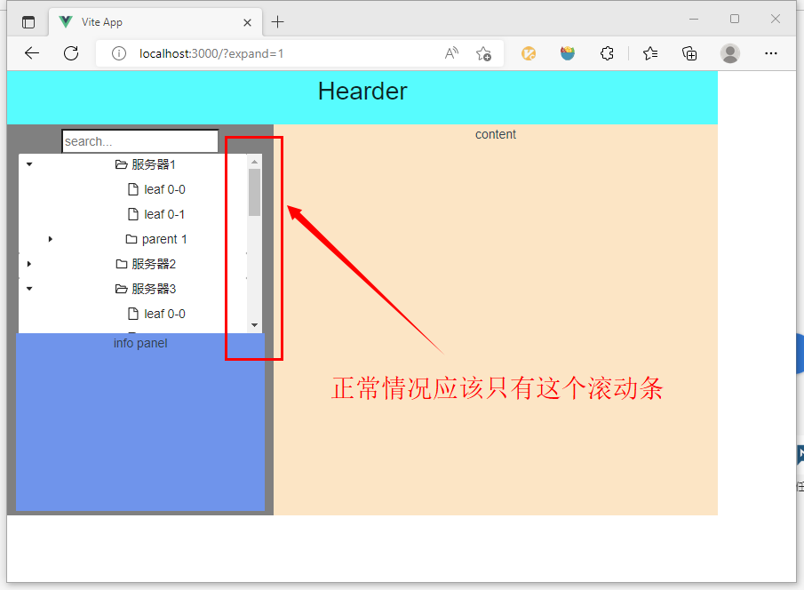
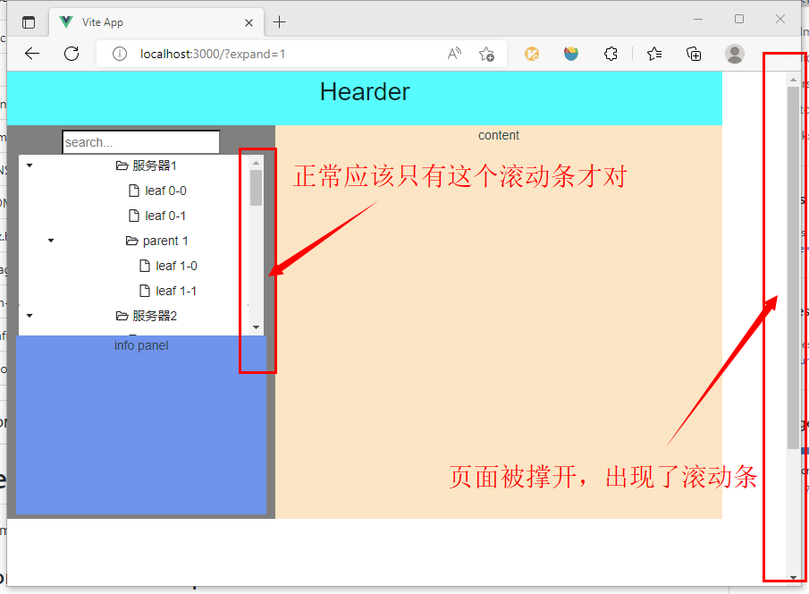

# antd vue 目录树组件撑开顶层父容器的bug 最小化 demo (ant-design-vue version: 3.2.11)

# bug 说明：
>将多个目录树组件（a-directory-tree）放到一个 div 容器下面并展开，会发现顶层父容器被撑开了，而且顶层父容器会有一个滚动条 

# bug 复现步骤：
0. 克隆项目到本地
1. 使用 pnpm i 命令安装依赖
2. 使用 pnpm dev 命令运行项目
3. 打开页面  http://localhost:3000 ，然后将页面大小调整为露出点白色背景即可
>
4. 折叠所有列表（使用url http://localhost:3000/?expand=0），可以发现页面右侧没有出现滚动条
>
5. 展开所有列表（使用url  http://localhost:3000/?expand=1），可以发现页面高度被撑开了，而且出现了滚动条

# 通过不断搜索，找到了的类似问题（但是解决方法确是更新版本）：
> Ant Design Drawer组件出现多滚动条:https://blog.csdn.net/qq_40593656/article/details/115507802

# 

# antd vue tree 组件文档：
> https://www.antdv.com/components/tree-cn

# 安装依赖命令：
> pnpm i

# 运行命令（成功后访问 3000 端口即可 http://localhost:3000/ ）：
> pnpm dev

# 注意： 构建命令 `pnpm build` 存在问题，请用运行命令 `pnpm dev` 进行测试；

>本项目基于该项目创建：
>https://github.com/snowdreamtech/vite-vue3-tsx-starter.git